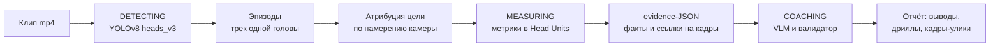

# Valorant AI Aim Coach

**Загрузи клип геймплея — получи объективный разбор аима с числами, кадрами-доказательствами и планом тренировок.**

Детектор находит головы врагов на каждом кадре, движок считает метрики наведения
в нормированных единицах, LLM-коуч объясняет посчитанное человеческим языком и
подбирает дриллы. Каждое утверждение коуча привязано к конкретному кадру и числу —
механический валидатор не даёт ему выдумывать.

> ### Это инструмент анализа записей, а не чит
>
> Работает **только с загруженным видеофайлом, после игры**. Не запускается вместе
> с игрой, не читает память процесса, не рисует оверлей, не управляет вводом и
> никак не влияет на геймплей. Функционально это разбор записи матча тренером,
> просто автоматический. Детекция голов применяется к пикселям mp4-файла — так же,
> как её применяют к любому другому видео.

<!-- TODO: демо. Записать 15-20 сек: загрузка клипа -> прогресс стадий -> отчёт с уликами.
     ScreenToGif -> docs/demo.gif, вставить строкой ниже:

-->

---

## Как это работает



**Стадии сессии:** `PENDING → DETECTING → MEASURING → COACHING → COMPLETED | FAILED`.
Если коуч упал, сессия всё равно завершается — у игрока остаётся отчёт движка без
текста. Частичный результат лучше пустого экрана.

### Head Units — почему числа сравнимы между клипами

Прицел в Valorant зафиксирован в центре экрана, поэтому смещение до головы
измеряется прямо в пикселях. Но пиксель зависит от разрешения и от дистанции до
врага. Все смещения нормируются на **высоту головы цели** (1 HU = высота её бокса):
дистанция сокращается, и клип в 1080p становится сравним с клипом в 1440p, а дальняя
дуэль — с ближней. Временные пороги задаются в секундах и переводятся в кадры через
fps, поэтому 30 и 60 fps тоже сопоставимы.

### Метрики

| Метрика | Что отвечает | Модуль |
|---|---|---|
| **Placement** | Где был прицел в момент появления врага — на линии головы или ниже? Считается на кадре рождения трека, до того как игрок успел среагировать. | `engine/metrics/placement.py` |
| **Consistency** | Разброс ошибки в дуэлях. Большой разброс — проблема повторяемости; малый разброс при большой ошибке — проблема калибровки. Это разные диагнозы за одним средним. | `engine/metrics/consistency.py` |
| **Bias** | Систематический увод по вертикали и горизонтали. | `engine/metrics/consistency.py` |
| **Correction** | Перелёт или недолёт на флике, по осям и со знаком. | `engine/metrics/correction.py` |
| **Flick phases** | Разложение флика на баллистику и доводку: `overshoot`, `settle_time`, `settle_jitter`, `correction_path`. | `engine/metrics/flick_phase.py` |
| **Progress** | Сдвинулась ли метрика после совета — кумулятивная дельта от якоря к текущему клипу. | `engine/metrics/drill_progress.py` |

Профиль игрока копится продольно по клипам (`engine/profile_store.py`), а уровень
уверенности проставляется явно: `diagnosis` / `hypothesis` / `insufficient`.

---

## Стек

**Backend:** Python 3.11+, FastAPI, SQLModel/SQLAlchemy, Alembic, arq (Redis), Pydantic
**ML/CV:** Ultralytics YOLOv8 (собственная обученная модель `heads_v3`), OpenCV, PyTorch
**LLM:** Google Gemini (по умолчанию) или Anthropic Claude — через общий адаптер провайдеров
**Frontend:** React 18
**Хранилище:** SQLite (dev) / PostgreSQL (прод), локальный диск / Cloudflare R2
**Инфраструктура:** Sentry, rate limiting, Discord OAuth, квоты free-тира
**Тесты:** pytest, 417 тестов

---

## Запуск

Нужен Python 3.11+, Node 18+ и ключ Gemini ([aistudio.google.com/apikey](https://aistudio.google.com/apikey)).

```bash
git clone https://github.com/Forio224/valorant-aim-coach.git
cd valorant-aim-coach

python -m venv .venv
# Windows
.venv/Scripts/python -m pip install -r requirements.txt -r backend/requirements.txt
# Linux / macOS
# source .venv/bin/activate && pip install -r requirements.txt -r backend/requirements.txt

cp .env.example .env      # вписать GEMINI_API_KEY
```

Backend:

```bash
.venv/Scripts/python -m uvicorn backend.main:app --port 8000
```

Frontend (в отдельном терминале):

```bash
cd frontend && npm install && npm start
```

API — `http://localhost:8000`, документация — `http://localhost:8000/docs`,
интерфейс — `http://localhost:3000`.

Из коробки поднимается dev-конфигурация: SQLite, фоновые задачи в процессе API,
файлы на диске, без авторизации. Прод-режим (Postgres, arq + Redis, R2, Discord OAuth,
лимиты) включается переменными окружения — все описаны в `.env.example`.

Веса детектора лежат в репозитории: `runs/detect/heads_v3/weights/best.pt` (19 МБ).

### Ключевые переменные

| Переменная | По умолчанию | Назначение |
|---|---|---|
| `GEMINI_API_KEY` | — | Обязательна для провайдера по умолчанию |
| `COACH_PROVIDER` | `gemini` | `gemini` или `anthropic` |
| `COACH_MODEL` | `gemini-3.5-flash` | Для `anthropic` — `claude-sonnet-5` |
| `DATABASE_URL` | `sqlite:///./aim_coach.db` | Postgres-URL нормализуется автоматически |
| `QUEUE_BACKEND` | `background` | `arq` — очередь в Redis, переживает рестарт API |
| `STORAGE_BACKEND` | `local` | `r2` — Cloudflare R2, загрузка мимо API |
| `AUTH_MODE` | `off` | `discord` включает логин, владение отчётами и квоты |
| `MAX_CLIP_SECONDS` | `120` | Кэп длины клипа: цена разбора линейна от длительности |

## Тесты

```bash
.venv/Scripts/python -m pytest -q
```

417 тестов. Тесты с маркером `integration` трогают реальные файлы датасета;
остальные работают без сети, GPU и внешних ключей — провайдеры и хранилище
инжектируются.

---

## Технические решения

Разделы ниже — про то, почему код устроен именно так.

### Движок измеряет, LLM только объясняет

Языковая модель не считает ни одного числа. Движок отдаёт ей **evidence-JSON** —
контракт с уже посчитанными метриками и ссылками на конкретные кадры и эпизоды.
Коуч обязан вернуть structured output по Pydantic-схеме, где каждое утверждение
трассируется к этим фактам.

Дальше работает механический валидатор (`coach/validate.py`): ответ сверяется с
evidence по четырём осям — номера кадров, HU-числа, ссылки на метрики и язык
уверенности. Провал → один ретрай со списком ошибок; повторный провал → деградация
в `coach_failed`, отчёт движка отдаётся без текста. Ошибка логируется, а не глотается.

Дриллы устроены так же: LLM выбирает только `drill_id` и объясняет выбор, а название
упражнения и числовой критерий успеха собирает движок из детерминированного каталога
(`coach/drill_catalog.py`, пороги — тиры Voltaic S5). Модель не может ни придумать
упражнение, ни назначить произвольную цель.

### Атрибуция цели: чью голову игрок ведёт

Первая версия считала разброс по «ближайшей к центру голове» независимо на каждом
кадре. Дефект: при смене врага под прицелом переключение влетало в разброс механики
игрока — хотя игрок действовал осознанно: заходил в спину, брал мультикилл, выбирал
сложную цель.

Между сегментацией эпизодов и метриками встал слой атрибуции
(`engine/attribution.py`): движение камеры оценивается по медиане смещений голов, из
него вычисляется **намерение** — насколько камера сокращает дистанцию до головы без
учёта собственного движения врага, — и правило с гистерезисом назначает один трек на
кадр. Спорные кадры честно помечаются `contested`, исключаются из механики, но
считаются. Всё это работает по детекциям, без повторного декодирования видео:
пиксельные позиции восстанавливаются из HU-сэмплов эпизодов.

### Границы эпизода не подыгрывают игроку

Эпизод — трек одной головы от первого видимого кадра до исчезновения. «Рядом с
прицелом» — это **тег внутри трека**, а не граница эпизода. Иначе пре-айм измерялся
бы на кадре, где голова уже около прицела по построению, и метрика льстила бы игроку.

### Версионирование методики измерения

Профиль хранит агрегаты, а не сырые сэмплы: пересчитать историю нельзя, для этого
нужен повторный прогон YOLO по видео, которого может уже не быть. Когда меняется
определение числа, старые записи остаются по прежней методике — и петля прогресса
отрапортовала бы смену методики как прогресс игрока.

Поэтому каждая запись штампуется `METRICS_VERSION` (`engine/version.py`); записи без
поля считаются версией 1 и в сравнение не входят. Текущая версия — 3.

### Что измеряется честно, а что прокси

Голова считается относительно **зафиксированного** прицела, поэтому смена знака
смещения может означать и перелёт руки, и стрейф врага через точку прицеливания.
Это output-space прокси, а не механика мыши, и так и написано в коде.

Смягчения: анализируются только флики, где скорость камеры доминирует
(`peak_closing_speed >= MIN_FLICK_SPEED_HU_S`), есть мёртвая зона против шума
детектора, окно анализа ограничено входом в дуэль плюс запас на доводку.
Пересчёт HU в сантиметры руки помечен как **эквивалент, а не измерение**, и доступен
только при известном eDPI и соотношении сторон 16:9 (`engine/input_space.py`).

### Сменные бэкенды вместо жёстких зависимостей

Очередь (`background` / `arq`), хранилище (`local` / `r2`) и провайдер LLM
(`gemini` / `anthropic`) реализуют общий `Protocol` и выбираются переменной
окружения. Разработка идёт без Redis, S3 и оплаченных ключей, прод получает нужное,
а тесты инжектируют заглушки и не ходят в сеть.

---

## Ограничения

- Модель обучена на голову врага в Valorant; на другие игры не переносится.
- Разбор идёт постфактум по записи; онлайн-режима нет и не планируется.
- Сантиметровый эквивалент требует известного eDPI и соотношения сторон 16:9.
- Каузальности в петле прогресса нет — считается только дельта и направление.
- Выстрелов в данных нет: момент попадания не измеряется, метрики опираются на
  видимую геометрию.

## Статус

Рабочий прототип: пайплайн end-to-end, 417 тестов, замеренная юнит-экономика
(`docs/UNIT_ECONOMICS.md` — около $0.10–0.15 за разбор двухминутного клипа).
Проектные решения по фазам — в `docs/superpowers/specs/`.

## Лицензия

MIT — см. [LICENSE](LICENSE).

Проект не аффилирован с Riot Games. Valorant — товарный знак Riot Games, Inc.
